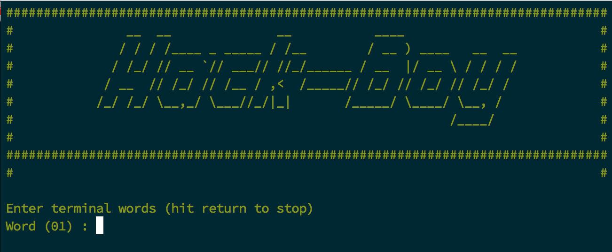

# hack-boy-perl

Interactive script to breack Fallout universe terminal passwords.

Default usage:

    ./hack-boy.pl

---

Maybe you prefer New Vegas:

    ./hack-boy.pl -nv
=======

---

# SYNOPSIS

**hack-boy.pl** \[**--help**\] \[**-d**\] \[**-nv**\] \[**-z**\]

## -h, --help

This output

## -d, --debug

5 levels of debug are supported.

    -d -d -d -d -d or -d 5

## -nv, --newvegas

Set the terminal color to that of New Vegas

## -z, --zerocolor

The -zerocolor option disables ANSI color output on message strings

# REQUIRES

Perl5.004, [strict](https://metacpan.org/pod/strict), [warnings](https://metacpan.org/pod/warnings), [Smart::Comments](https://metacpan.org/pod/Smart::Comments)
